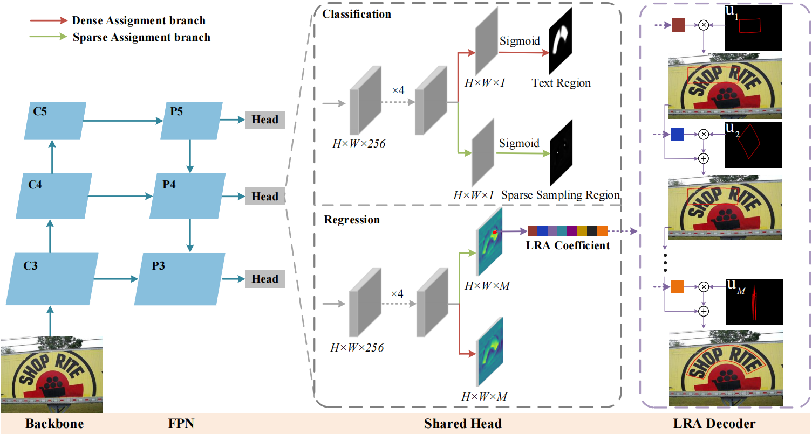

# <h1 align="center"> LRANet: Towards Accurate and Efficient Scene Text Detection with Low-Rank Approximation Network </h1> 

<div align="center">
    
</div>

This is the official implementation of Paper: [LRANet: Towards Accurate and Efficient Scene Text Detection with Low-Rank Approximation Network](https://arxiv.org/abs/2306.15142.pdf) (AAAI 2024 Oral).

## Environment
This implementation is based on mmocr-0.2.1, so please refer to it for detailed requirements. Our code has been test with Pytorch-1.8.1 + cuda11.1
We recommend using [Anaconda](https://www.anaconda.com/) to manage environments. Run the following commands to install dependencies.
```
conda create -n lranet python=3.7 -y
conda activate lranet
 conda install pytorch=1.8 torchvision cudatoolkit=11.1 -c pytorch -c nvidia -c conda-forge
pip install mmcv-full==1.3.9 -f https://download.openmmlab.com/mmcv/dist/cu111/torch1.8.0/index.html
pip install mmdet==2.14.0
git clone https://github.com/ychensu/LRANet
cd LRANet
pip install -r requirements.txt
python setup.py build develop
```

## Dataset

Please download TotalText, CTW1500, and SynText150k according to the guide provided by TPSNet: [README.md](https://github.com/Wei-ucas/TPSNet).


Please download and extract the above datasets into the `data` folder following the file structure below.
```
data
├─totaltext
│  │ totaltext_train.json
│  │ totaltext_test.json
│  └─imgs
│      ├─training
│      └─test
├─CTW1500
│  │ instances_training.json
│  │ instance_test.json
│  └─imgs
│      ├─training
│      └─test
├─synthtext-150k
      ├─syntext1
      │  │  train_polygon.json
      │  └─images
      ├─syntext2
         │  train_polygon.json
         └─images
```

## Train
```
CUDA_VISIBLE_DEVICES=0,1,2,3 ./tools/dist_train.sh configs/lranet/lranet_totaltext_det.py work_dirs/totaltext_det 4
```

## Evaluation
```
CUDA_VISIBLE_DEVICES=0 python tools/test.py configs/lranet/lranet_totaltext_det.py work_dirs/totaltext_det/latest.pth --eval hmean-e2e
```


## Trained Model
Total-Text : [One Drive](https://onedrive.live.com/?redeem=aHR0cHM6Ly8xZHJ2Lm1zL3UvYy81YWE2OWZiZTU4NDY0MDYxL0VZdmxkOXBEWUFGSnM2SERNNWFscWFjQlRpejVtWG5WZmxoQ1JiUFlmX0x1SXc%5FZT1rY3RBa3k&cid=5AA69FBE58464061&id=5AA69FBE58464061%21sda77e58b60434901b3a1c33396a5a9a7&parId=root&o=OneUp)


## Acknowledgement
We sincerely thank [MMOCR](https://github.com/open-mmlab/mmocr), [ABCNet](https://github.com/aim-uofa/AdelaiDet/tree/master/configs/BAText), and [TPSNet](https://github.com/Wei-ucas/TPSNet) for their excellent works.